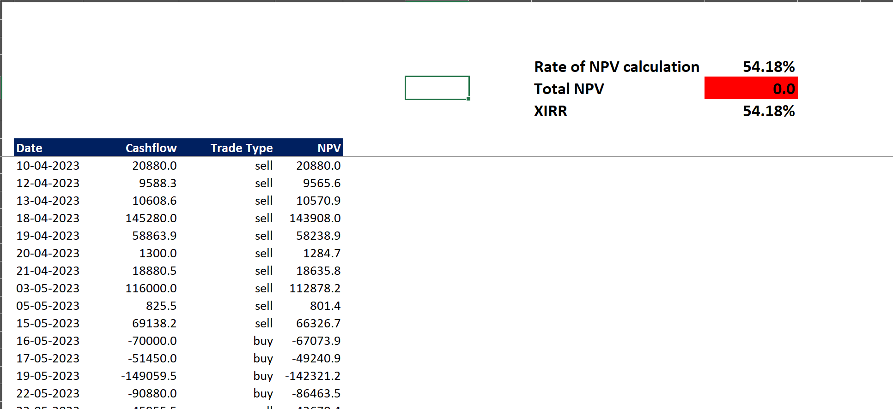
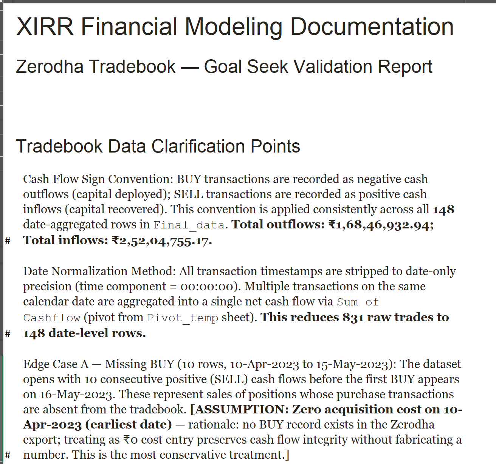
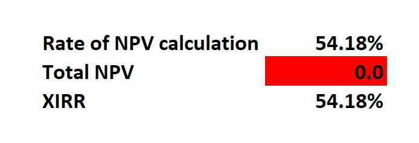
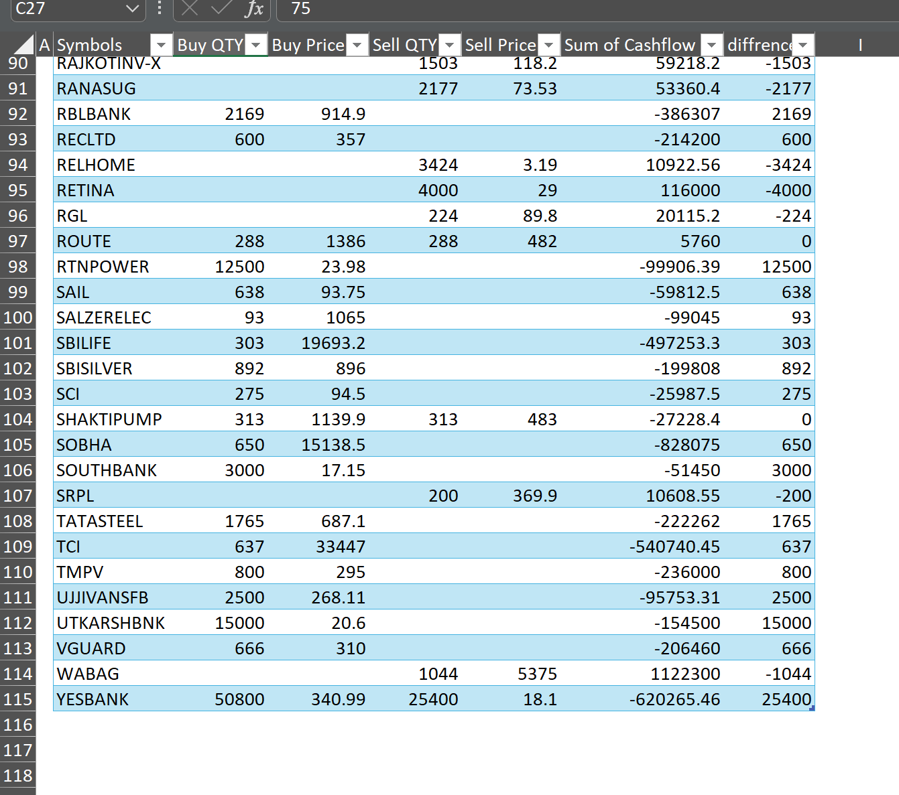
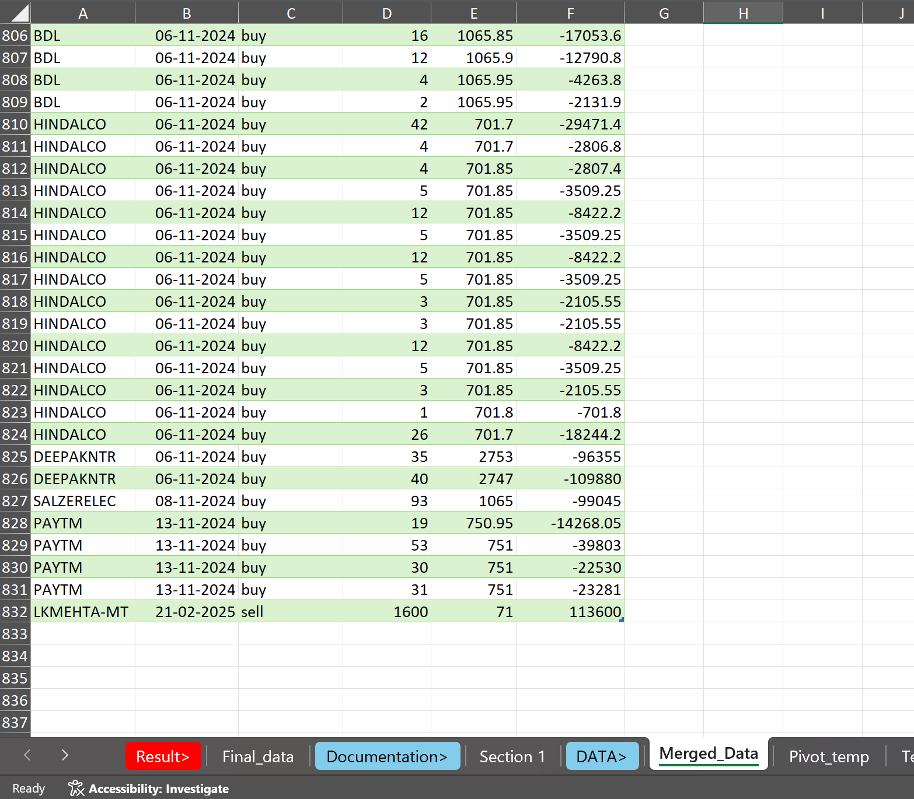

# 📊 Portfolio XIRR Calculator — Zerodha Tradebook (Apr 2023 – Apr 2026)

**Annualized Return: 54.18% | Alpha over Nifty 50: ~45.5% | 831 trades → 80 date-rows | Goal Seek workaround for Excel #NUM! error**

---

## 🧩 Business Problem

Zerodha's tradebook export does not natively calculate portfolio-level XIRR, especially when:
- Purchase records are missing for early positions (open before the export window)
- Positions are still open at the time of analysis (no SELL record exists)
- Transactions span 3 years with 831 rows across irregular dates

Excel's `XIRR()` function returned `#NUM!` error on this dataset. This project diagnoses the exact root cause and solves it using Goal Seek — producing a validated annualized return of **54.18%**.

---

## 💡 Why This Matters

XIRR (Extended Internal Rate of Return) is the industry-standard metric for measuring real portfolio performance across irregular cash flows. It accounts for the timing of every buy and sell — unlike simple return % which ignores when money was deployed.

Solving XIRR on broken, real-world brokerage data is a problem every portfolio analyst, wealth manager, and fintech analyst faces. This project documents a reproducible methodology for handling it in Excel without any external tools or coding.

---

## 📁 Data Source

- **Source:** Zerodha tradebook export (personal brokerage account)
- **Raw data:** 831 transactions, April 10, 2023 – April 14, 2026
- **Privacy:** All sensitive identifiers removed. Open position prices sourced from NSE closing prices on April 14, 2026.
- **Nature:** Real-world data with structural gaps — not a synthetic or course dataset

> All personally identifiable information (client ID, order ID, account details) 
> has been removed. Only trade date, stock symbol, quantity, price, and 
> direction (buy/sell) are retained — all of which constitute publicly 
> available market data.

---

## ⚙️ Methodology & Approach

### Preprocessing Pipeline
**Raw Tradebook (831 rows)**
- Date-level aggregation via Pivot (Pivot_temp sheet)
- Sign convention enforcement: BUY = negative (outflow), SELL = positive (inflow)
- Chronological sort (mandatory for Excel XIRR)
- 80 date-aggregated net cash flow rows (Final_data sheet)

### Edge Case 1 — Missing BUY Records (10 rows, Apr 10 – May 15, 2023)
The dataset opens with 10 consecutive SELL cash flows before the first BUY appears on May 16, 2023. These represent positions purchased before the tradebook export window.

**Treatment:** ₹0 acquisition cost assumed on April 10, 2023 (earliest date). This is the most conservative assumption — it does not fabricate a number, preserves cash flow integrity, and slightly overstates returns for these positions (acknowledged as a limitation).

### Edge Case 2 — Open Positions (68 positions, no SELL record)
68 positions held as of April 14, 2026 have no SELL transaction in the tradebook.

**Treatment:** All open positions marked to market using NSE closing prices on April 14, 2026 (sourced from `Open_positions` sheet). Market value (Qty × Price) entered as positive inflow on April 14, 2026 — standard XIRR treatment for unrealized positions, equivalent to a hypothetical same-day liquidation.

### Why Excel XIRR() Returned #NUM!
Excel's `XIRR()` requires the **first cash flow to be negative** (an initial investment outflow). In this dataset, the first 10 rows are all positive (SELL without preceding BUY), creating a structural sign-pattern violation — not a convergence failure. Excel cannot find a valid initial guess to begin iteration.

### Goal Seek Workaround
Instead of `=XIRR(cashflows, dates)`:
1. Built manual NPV formula: `NPV = Σ [CF_i / (1 + r)^((date_i - date_0)/365)]`
2. Used **Goal Seek**: Set NPV cell → To value: `0` → By changing: rate cell
3. Result: **XIRR = 54.18%** with NPV = 4.64e-6 ≈ 0 ✅ (validated)

---

## 🛠️ Tech Stack

| Tool | Purpose |
|---|---|
| Excel (Power Query) | Date aggregation, pivot, preprocessing |
| Excel (Pivot Table) | 831 raw rows → 80 date-level rows |
| Excel (Manual NPV Formula) | XIRR iteration substitute |
| Excel (Goal Seek) | Solving for rate where NPV = 0 |

No Python or external libraries used — entirely reproducible in any Excel version.

---

## 📈 Results

| Metric | Value |
|---|---|
| Portfolio XIRR (Annualized) | **54.18%** |
| Nifty 50 CAGR (same period, Apr 2023 – Apr 2026) | ~8.70% |
| Alpha over Nifty 50 | ~**45.5 percentage points** |
| Total Capital Deployed (Outflows) | ₹1,68,46,932.94 |
| Total Capital Recovered (Inflows incl. MTM) | ₹2,52,04,755.17 |
| Raw transactions | 831 |
| Date-aggregated cash flow rows | 80 |
| Analysis period | Apr 10, 2023 – Apr 14, 2026 (~3 years) |

---

## 📸 Visual Proof

### XIRR Result (54.18%) — Final_data Sheet

### Assumption Documentation Log

### Goal Seek Validation — NPV ≈ 0

### Preprocessing — 831 Rows → 80 Date-Rows

### Raw Tradebook — Merged_Data (831 rows, tab structure)

---

## ⚠️ Limitations

1. **Missing BUY records (10 rows):** Treated as ₹0 cost — slightly overstates returns for those positions
2. **Open positions marked on single date:** MTM prices from April 14, 2026 only — point-in-time snapshot, not realized
3. **No benchmark comparison within model:** Nifty 50 CAGR comparison in this README uses approximate index levels
4. **Excel-only:** Not reproducible in Python yet (future scope)

---

## 🔭 Future Scope

- [ ] Python replication using `scipy.optimize.brentq` for XIRR (eliminates Excel dependency)
- [ ] Per-stock XIRR breakdown to identify top/bottom performers
- [ ] Rolling 1-year XIRR chart to visualize return consistency over time
- [ ] Benchmark-adjusted alpha with actual Nifty 50 daily closing data from NSE

---

## 👤 Author

**Anshul Chaudhary**
MCom | CMA Intermediate (Group 1 Cleared, ICMAI)
[LinkedIn](http://linkedin.com/in/anshul-chaudhary-508138308) | [GitHub](http://github.com/morid648)
